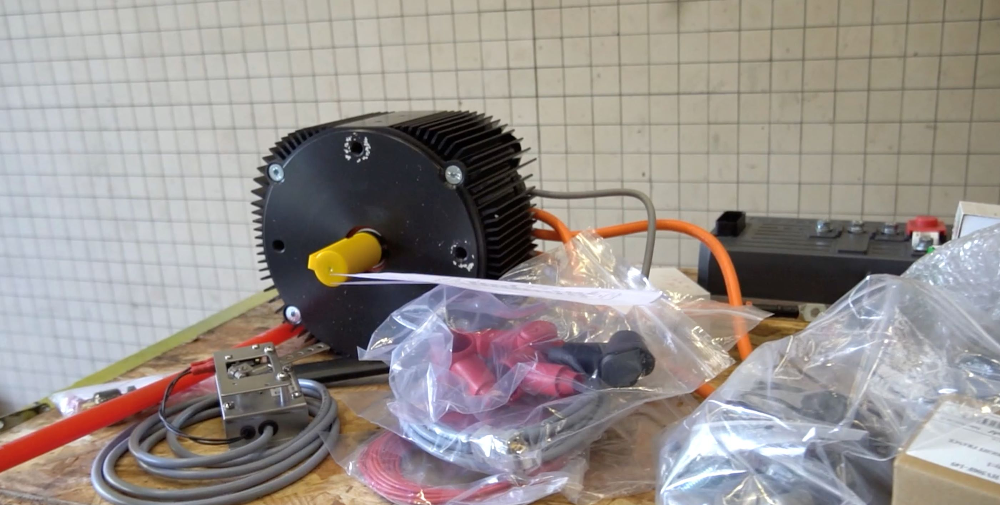

## ENSTRAID: Transforming the Future of Mobility

ENSTRAID is an innovative student-led association at ENSTA Paris, focused on retrofitting thermal vehicles into fully electric ones. Our flagship project involves converting a classic Peugeot 205 into a 100% electric vehicle, demonstrating the potential of green energy solutions in the automotive sector. This initiative not only contributes to the ecological transition but also promotes practical engineering experience for students.

As the **Treasurer** of ENSTRAID during its founding, I oversaw the financial management and ensured that the project stayed within budget while securing necessary funding. We successfully raised **€10,000**, mainly from ENSTA alumni and IP Paris, which was crucial for moving the project forward.

Through collaboration with partners and fellow students, ENSTRAID exemplifies a hands-on approach to sustainability and technical expertise, actively contributing to reducing the environmental impact of older vehicles.

For more details, you can read about our progress and achievements:
- [Retrofitting a Peugeot 205 into a 100% electric vehicle](https://www.ensta.org/fr/news/retrofit-transformer-une-peugeot-205-thermique-en-vehicule-100-electrique-537)
- [ENSTRAID’s role in ecological transition at ENSTA Paris](https://www.ensta-paris.fr/fr/enstraid-transition-ecologique-sur-bonne-voie)

---

## Some Photos

*The Peugeot 205 before the electric conversion.*

*Motor installation for the vehicle’s electric conversion.*

---

## **Update (2024-12-05): Final Build and Video**

We are thrilled to announce the completion of our project! The retrofitted Peugeot 205 is now fully functional as an electric vehicle. This milestone represents months of dedicated effort, collaboration, and problem-solving by the ENSTRAID team.

To showcase the final build, we have created a video summarizing the journey of converting the Peugeot 205. Check it out below:

  

This video highlights the engineering process, challenges, and success of this incredible project. Thank you to everyone who supported ENSTRAID along the way!

---