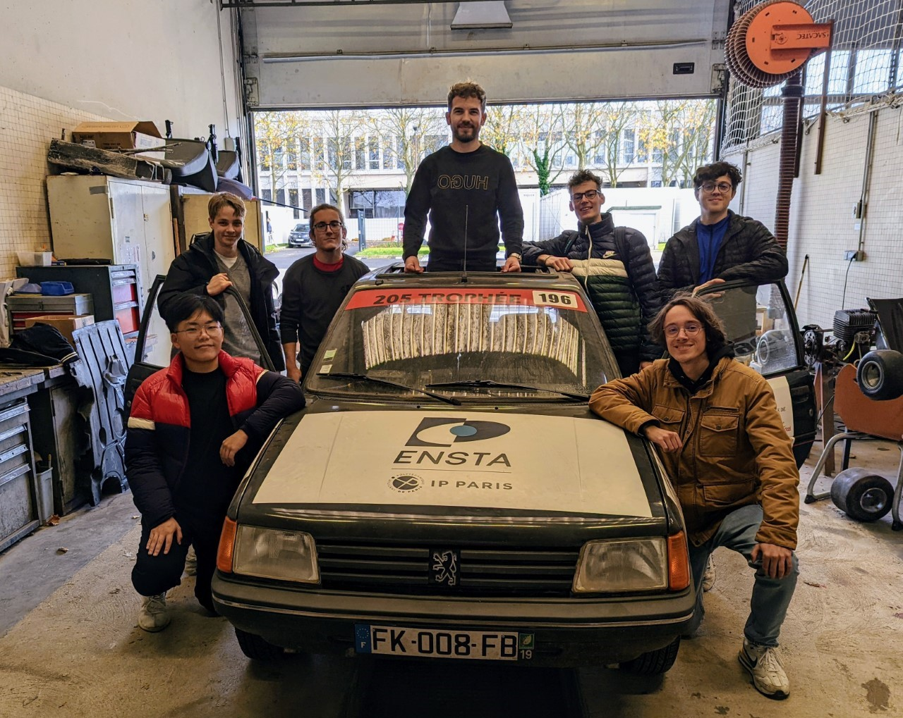
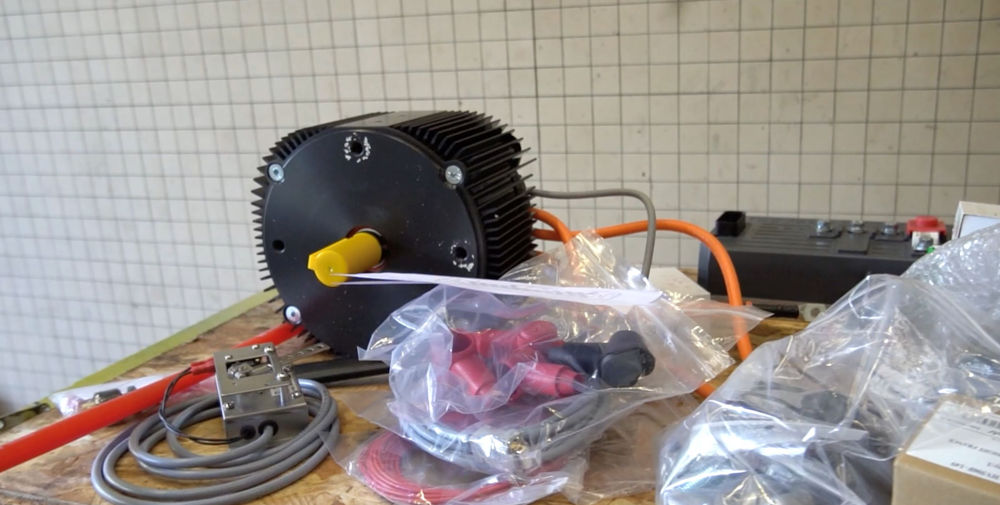

## ENSTRAID：改变未来出行方式

ENSTRAID 是一个由 ENSTA Paris 学生领导的创新协会，专注于将传统燃油汽车改装为全电动汽车。我们的旗舰项目是将一辆经典的标致 205 改装为 100% 电动汽车，展示了绿色能源解决方案在汽车行业的潜力。该项目不仅为生态转型作出贡献，还为学生提供了宝贵的工程实践经验。

作为 ENSTRAID 创始期间的 **财务主管**，我负责财务管理，确保项目在预算内进行，并获得了必要的资金支持。我们成功筹集了 **10,000 欧元**，主要来自 ENSTA 和 IP Paris 的校友，这对项目的推进至关重要。

通过与合作伙伴和学生的合作，ENSTRAID 展现了可持续性与技术专业性的结合，积极为减少旧车的环境影响贡献力量。

想了解更多我们的进展与成就：
- [将标致 205 改装为 100% 电动汽车](https://www.ensta.org/fr/news/retrofit-transformer-une-peugeot-205-thermique-en-vehicule-100-electrique-537)
- [ENSTRAID 在 ENSTA Paris 生态转型中的作用](https://www.ensta-paris.fr/fr/enstraid-transition-ecologique-sur-bonne-voie)

## 一些照片

*改装前的标致 205。*

*为车辆电动改装安装电动机。*
